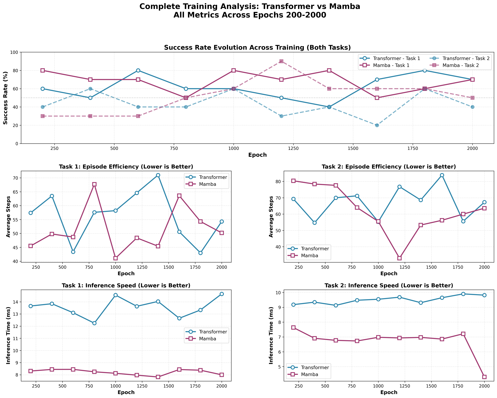

# OpenARM VLA Imitation Learning (Transformer + Mamba) Framework

Clone the repo:

```bash
git clone git@github.com:sainavaneet/OpenARM-VLA.git
```

Make sure Docker is installed with GPU access (NVIDIA Container Toolkit).

# Update submodules

```bash
cd OpenARM-VLA
git submodule update --init --recursive
```

# Local setup

First install Isaac Lab via pip using the official guide:

```
https://isaac-sim.github.io/IsaacLab/main/source/setup/installation/pip_installation.html
```

Then activate the environment:

```bash
conda activate env_isaaclab
```

Install the OpenARM Isaac Lab package:

```bash
python -m pip install -e openarm_isaac_lab/source/openarm
```

Make sure `nvcc` is available. Skip this if CUDA toolkit is already installed:

```bash
sudo mkdir -p /etc/apt/keyrings \
  && curl -fsSL "https://developer.download.nvidia.com/compute/cuda/repos/ubuntu$(lsb_release -rs | tr -d .)/x86_64/3bf863cc.pub" \
    | gpg --dearmor | sudo tee /etc/apt/keyrings/cuda-archive-keyring.gpg > /dev/null \
  && echo "deb [signed-by=/etc/apt/keyrings/cuda-archive-keyring.gpg] https://developer.download.nvidia.com/compute/cuda/repos/ubuntu$(lsb_release -rs | tr -d .)/x86_64/ /" \
    | sudo tee /etc/apt/sources.list.d/cuda.list > /dev/null \
  && sudo apt-get update \
  && sudo apt-get install -y --no-install-recommends cuda-toolkit-12-8
```

Install `mamba-ssm`:

```bash
python -m pip install --no-cache-dir --force-reinstall --no-deps mamba-ssm --no-build-isolation
```

# Blackwell GPUs (RTX 50 / B200 / GB200)

If you are on a Blackwell GPU, install the CUDA 12.8 PyTorch build and then rebuild `mamba-ssm`:

```bash
python -m pip install --index-url https://download.pytorch.org/whl/cu128 torch==2.7.0+cu128
python -m pip install --no-cache-dir --force-reinstall --no-deps mamba-ssm --no-build-isolation
```


# Scripts

Recommended flow:

1. Generate the dataset.
2. Train the model.
3. Evaluate the model (or compare models).


`scripts/create_dataset.sh` generates the dataset using `conf/generate_dataset.yaml`.

```bash
bash scripts/create_dataset.sh
```

`scripts/train_model.sh` runs training with defaults from `conf/config.yaml` and `conf/generate_dataset.yaml`.

```bash
bash scripts/train_model.sh
```

`scripts/eval_model.sh` runs evaluation. It auto-detects the latest checkpoint under `outputs/**/train/<model>/` when no checkpoint is provided.

```bash
bash scripts/eval_model.sh
bash scripts/eval_model.sh transformer
bash scripts/eval_model.sh mamba /path/to/checkpoint.pth
```


# Docker setup 

```bash
docker compose up -d --build

```

```bash
docker compose exec openarm bash
```
For Docker builds on Blackwell GPUs, replace the install step in `Dockerfile` with:

```bash
WORKDIR ${OPENARM_ROOT}
ENV UV_PYTHON=/workspace/isaaclab/_isaac_sim/kit/python/bin/python3
RUN --mount=type=cache,target=/root/.cache/pip \
    ${UV_PYTHON} -m pip install --index-url https://download.pytorch.org/whl/cu128 torch==2.7.0+cu128 \
 && ${UV_PYTHON} -m pip uninstall -y mamba-ssm \
 && ${UV_PYTHON} -m pip install --no-cache-dir --force-reinstall --no-deps mamba-ssm --no-build-isolation \
 && uv pip install -e ${OPENARM_ROOT}
```
Docker equivalents are under `scripts/docker/`:

```bash
bash scripts/docker/train_model.sh
bash scripts/docker/eval_model.sh
bash scripts/docker/compare_models.sh
```


# Eval


