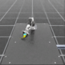
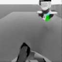

```{r setup, include=FALSE}
.libPaths(c('~/R/library', .libPaths()))
```


# Introduction

This report presents OpenARM-VLA, a Vision-Language-Action learning framework developed for robotic manipulation using the OpenArm platform in NVIDIA Isaac Sim, 
I evaluate the OpenARM-VLA framework using both MambaVLA and MDT Transformer architectures. 
My primary objective is to systematically compare state space and transformer-based policies on a cube lifting task involving directional motion commands. 
To achieve this, I construct a synthetic data generation pipeline with a reinforcement learning teacher policy to produce large-scale demonstration trajectories. 
This setup allows for fair benchmarking across architectures under identical perception, control, and simulation conditions. 
Experimental results demonstrate reliable task completion, establishing a foundation for scalable imitation learning and future foundation model training for robotic manipulation.

## Pipeline Overview

```text
    ┌───────────────────────────────────────────────────────────────┐
    │                                                               │
    │        OpenARM Cube Lifting Task Environment (Isaac Sim)      |
    |                                                               |
    │   • Created Cameras for the observations                      |
    |                                                               |
    |   • Multi-direction lifting commands                          |
    |   • RGB camera observations                                   |
    |   • Randomized cube poses                                     |
    |                                                               |
    └───────────────────────────────────────────────────────────────┘
    ┌───────────────────────────────────────────────────────────────┐
    │                 Rollout Trajectory Collection                 │
    │                                                               │
    │  { Images | Robot States | Language Commands | Actions }      │
    │                                                               │
    └───────────────────────────────┬───────────────────────────────┘
                                    │
                                    ▼
                        ┌──────────────────────────┐
                        │   Episode Evaluation     │
                        │──────────────────────────│
                        │  SUCCESS  →  Save Demo   │
                        │  FAILURE  →  Discard     │
                        └─────────────┬────────────┘
                                      │
                                      ▼
    ┌───────────────────────────────────────────────────────────────┐
    │                  Demonstration Dataset Store                  │
    │                                                               │
    │  • Large scale trajectories                                   │
    │  • Balanced directions                                        │
    │  • Train / Val / Test splits                                  │
    │                                                               │
    └───────────────────────────────┬───────────────────────────────┘
                                    │
                                    ▼
    ┌───────────────────────────────────────────────────────────────┐
    │                     Imitation Learning via Flow Matching      │
    │                         Diffusion Policy Training             │
    │                                                               │
    │   Conditioning:                                               │
    │     • Visual Tokens                                           │
    │     • Language Tokens                                         │
    │     • Robot State                                             │
    │                                                               │
    │   Backbone Networks:                                          │
    │     ┌──────────────────────┐        ┌────────────────────────┐│
    │     │        MambaVLA      │        │    Transformer Model   ││
    │     │  (State Space Model) │        │ (Attention Based Model)││
    │     └─────────────┬────────┘        └─────────────┬──────────┘│
    │                   │                               │           │
    │                   └───────────────┬───────────────┘           │
    │                                   ▼                           │
    │                         Action Trajectory Predictor           │
    │                      (Joint Targets + Gripper Cmd)            │
    └───────────────────────────────┬───────────────────────────────┘
                                    │
                                    ▼
    ┌───────────────────────────────────────────────────────────────┐
    │                    Policy Evaluation in Simulation            │
    │                                                               │
    │        OpenARM Cube Lifting Task Environment (Isaac Sim)      │
    │                                                               │
    │  • Success Rate                                               │
    │  • Completion Time                                            │
    │  • Failure Modes                                              │
    │                                                               │
    └───────────────────────────────────────────────────────────────┘
```
# Simulation Environment

I used the OpenArm already available Env `Isaac-Lift-Cube-OpenArm-v0` for the simulation.

But as the default RL env doesnt have the cameras, I created cameras for the `Isaac-Lift-Cube-OpenArm-Play-v0` env.

I created three cameras:

- `camera_link0`: This is the camera attached to the link0 of the robot.
- `camera_fixed`: This is the camera attached to the fixed frame of the robot.
- `main_camera`: This is used to record videos of the robot performing the task.

## Dataset Camera Views

```{=html}
<div style="display: flex; gap: 15px; flex-wrap: wrap; align-items: flex-start;">
  <div style="width:15%; display:flex; flex-direction:column; align-items:center;">
    
    <span style="margin-top:12px; font-size:1em; color:#444;">camera_link0</span>
  </div>
  <div style="width:15%; display:flex; flex-direction:column; align-items:center;">
    
    <span style="margin-top:12px; font-size:1em; color:#444;">camera_fixed</span>
  </div>
</div>
```


# Dataset & Demonstrations

I collected 100 demonstration for each task that is metnioned in the `conf/tasks.yaml` file.

```yaml
tasks:
  task0:
    name: pick_the_cube_and_lift_it_to_the_middle_of_the_table
    target_pose: "0.25,0.0,0.25"
  task1:
    name: pick_the_cube_and_reach_to_the_right_side_but_slighlty_lower
    target_pose: "0.25,-0.20,0.20"

```

Each demo is stored under: `data/demo_<id>/`

```python
data/demo_<id>/
  actions        (T, 8)      float32
  dones          (T,)        int64
  rewards        (T,)        float32
  robot_states   (T, 9)      float32
  obs/
    agentview_rgb    (T, 128, 128, 3)  uint8
    eye_in_hand_rgb  (T, 128, 128, 3)  uint8
    joint_states     (T, 6)            float32
    gripper_states   (T, 2)            float32
```
